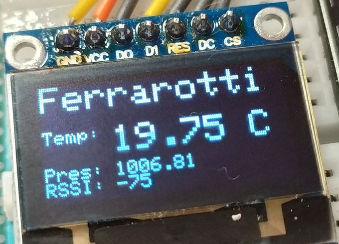

# ESP32_ESPNOW_RSSI

This works on two ESP32s and is partly based on the examples from the ESP32 course by [Sara & Rui Santos](https://randomnerdtutorials.com)

The idea is to read digital inputs and temperature and transmitt them to the receiver by Espressif's ESP_NOW protocol.

There is a particular LED that indicates if the receiver "listens" to the transmitter (when it is on) and I an OLED display that show the result from the BMP280 and the RSSI value of the received packet.

I have tested it in the field and indeed when I move away from the "transmitter" the RSSI value increases (as it should be) and when I get closer, it decreases.

This code contains copied and pasted parts taken from the ESP32 Espressif forum, based on the idea of ​​https://www.esp32.com/viewtopic.php?t=13889 and partially modified.

I hope my code is understandable...

If you find this information useful and interesting, invite me for a coffee!!!
https://cafecito.app/marce_ferra

If you found this information useful and interesting, buy me a cafecito!!!
https://www.buymeacoffee.com/marceferra
